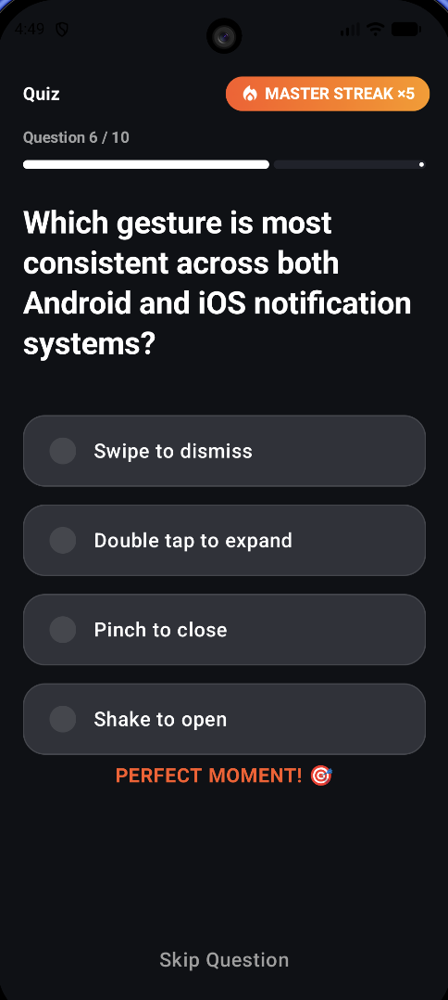
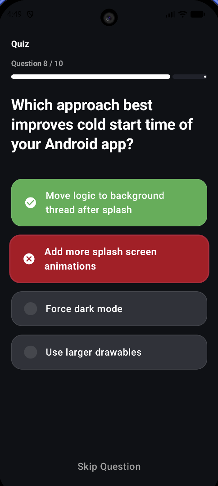
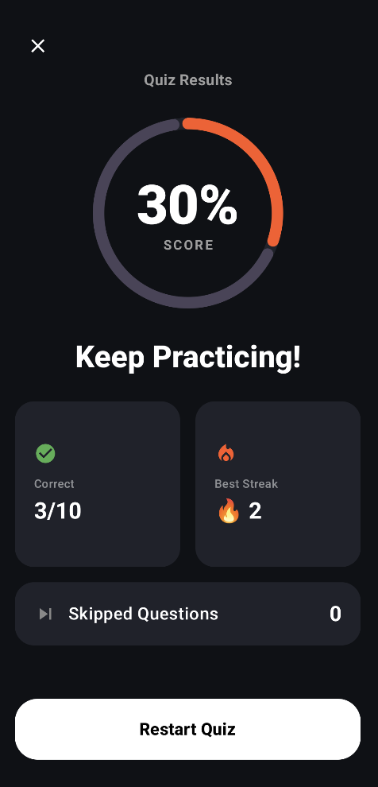

# Premium Android Quiz App

A modern, high-performance Quiz application built with **Clean Architecture**, **MVVM**, and **Jetpack Compose Material 3**. This project demonstrates a production-quality approach to building engaging, resilient, and accessible mobile experiences.

## 📸 Visual Preview

### [Watch the Demo Video](https://drive.google.com/file/d/1XD8aQozqg4h1qO1ytfdlkZlGU6ghwdh0/view?usp=sharing)

## Screenshots

### Home & Streak Screen

### Answer Selection

### Result Screen

### Error State

## 🚀 Key Features & Implementation Details

### 1. Functionality & Technical Core
*   **Robust API Handling**: Powered by **Retrofit** and **Kotlinx Serialization**. I implemented a custom `ApiResult` sealed interface to handle Network, HTTP, and Unknown exceptions without throwing, ensuring a crash-free experience.
*   **Sequential Question Navigation**: Logic is decoupled from the UI. The `QuizViewModel` manages the index and state transitions, including a **2-second auto-advance** timer after answer reveals.
*   **Advanced Streak Logic**: Tracks consecutive correct answers. The logic resides in the ViewModel to ensure it's unit-testable and independent of UI recompositions.
*   **Comprehensive Results**: A dedicated screen summarizing performance, including correct count, total questions, skipped count, and the user's best streak.

### 2. Code Quality & Architecture
*   **Clean Architecture**: Strictly separated into `Domain`, `Data`, and `Presentation` layers.
    *   **Domain**: Contains pure Kotlin entities, Repository interfaces, and Use Cases.
    *   **Data**: Handles Retrofit implementation, DTOs, and Mappers to ensure data details never leak into business logic.
    *   **Presentation**: MVVM pattern using a single `QuizUiState` for a predictable, unidirectional data flow.
*   **Dependency Injection**: Full integration with **Hilt** for scalable and testable dependency management.
*   **Readability & SOLID**: Code is organized into small, reusable components. Each class has a single responsibility, and naming follows standard Kotlin/Android conventions.

### 3. UI/UX Design Philosophy
*   **Tactile Feedback**: Every interaction provides a physical response. Options scale down when pressed and scale up when selected, mimicking real-world buttons.
*   **Modern Visuals**: Implemented an immersive dark theme using Material 3, with a clear typography hierarchy (ExtraBold for questions, Medium for options) and 8dp-grid based spacing.
*   **Responsive Layouts**: Uses `Scaffold` and `safeDrawingPadding` to ensure the UI looks perfect on all screen sizes, respecting camera cutouts and system bars.
*   **Intuitive Flow**: The user journey is seamless from the splash screen to the results, with clear "Empty" and "Error" states to handle edge cases gracefully.

### 4. Attention to Detail (Micro-Interactions)
*   **Staggered Entrance**: Options don't just appear; they slide in with a sequential delay to guide the user's eye and reduce cognitive load.
*   **"On Fire" Gamification**: When a streak hits 3, the badge transforms with a vibrant gradient and a rhythmic pulse animation, creating a high-dopamine milestone moment.
*   **Gesture Support**: Integrated **Swipe-to-Skip** functionality using `detectHorizontalDragGestures`. The physical act of "tossing" a card aside makes the app feel premium and modern.
*   **Smooth State Transitions**: All screen changes (Loading -> Quiz -> Results) use `AnimatedContent` with tailored fade and slide transitions for a cinematic feel.

## 🛠 Tech Stack
*   **Language**: Kotlin (Coroutines, Flow)
*   **UI**: Jetpack Compose (Material 3)
*   **Architecture**: Clean Architecture + MVVM
*   **DI**: Hilt
*   **Networking**: Retrofit + OkHttp
*   **Serialization**: Kotlinx Serialization
*   **Image/Icons**: Material Icons Extended

---

### How to Run
1. Clone the repository.
2. Open in Android Studio (Ladybug or newer).
3. Build and run on an emulator or physical device (API 24+).
